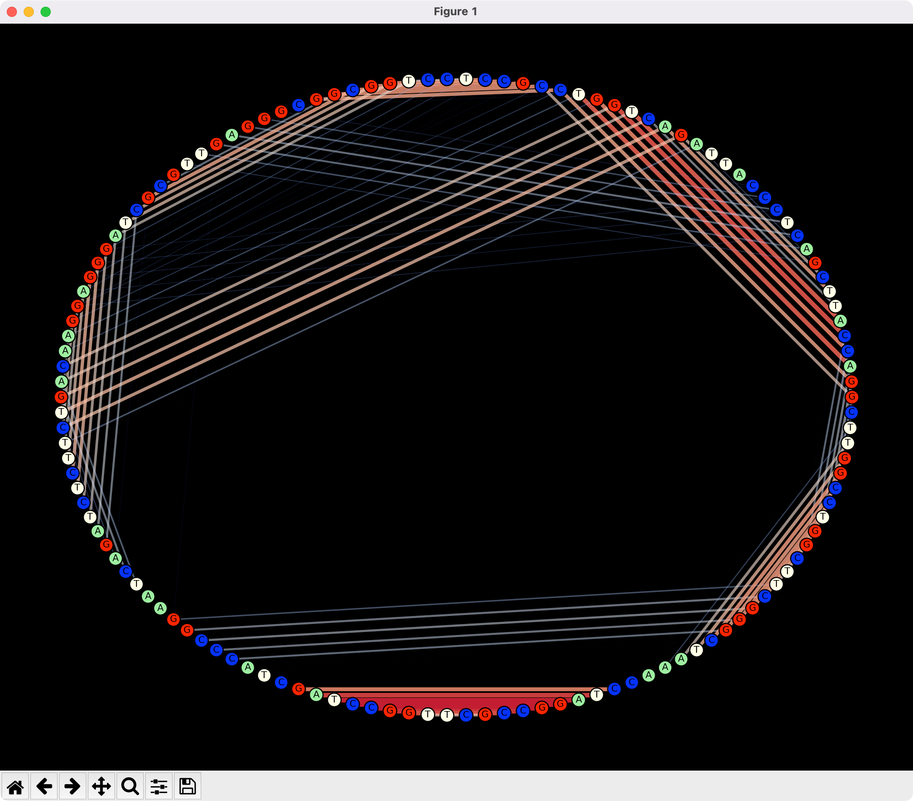
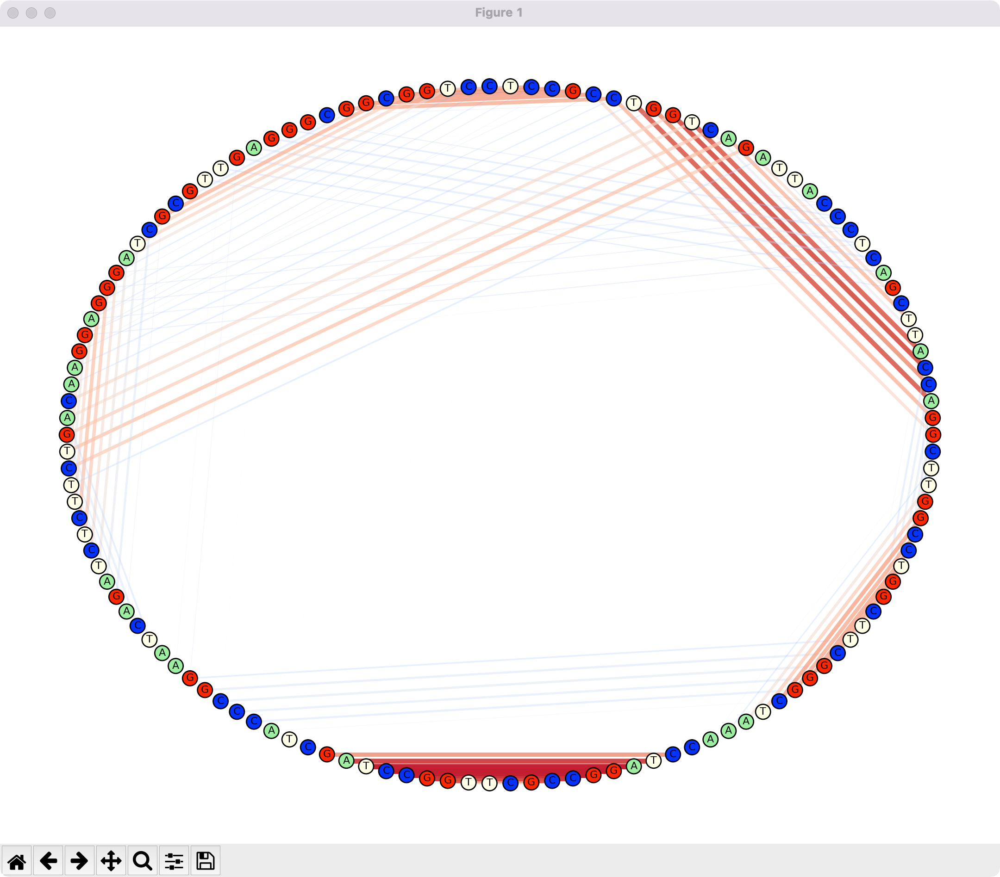
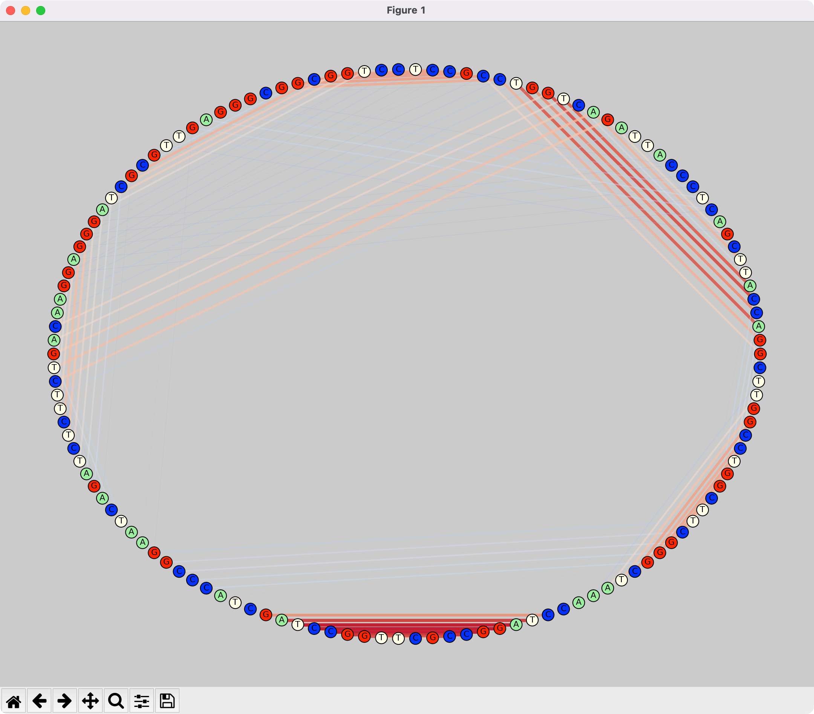
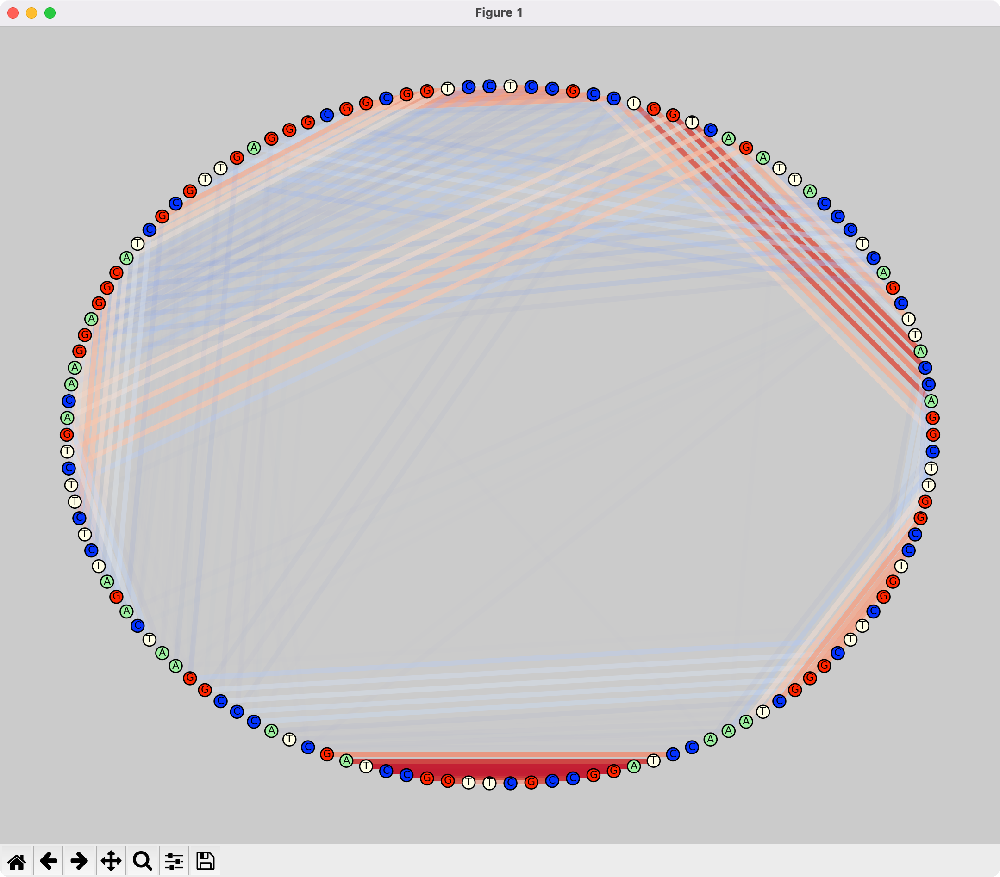

# Donut Diagram   
  
File: donut.py  
Author: Vincent Beaulieu  
Date: 14 September 2022  
  
Suggestion from Dr. Nawwaf Kharma - Concordia University 
  
## Info:  
Display in a circular diagram the folding probabilities of an RNA sequence using a coolwarm colormap  
  
## Requirements:  
- The probability matrix ".prob" generated by VARNA RNA.  
- The whole rna sequence used for the folding (eg.: a fasta/txt/csv/etc. file containing the sequence).  
- The networkx library available at https://networkx.org.
- The csv, matplotlib, and numpy libraries.  
  
## Comments:  
This code is mostly generalized and may require minimal modification to adapt it to your particular file input.  
These modifications are:  
- The filepath.  
- The line number at which the whole RNA sequence is situated in the input file.  
- The styles parameters:  
    - Relative edge thickness enabled/disabled (parameter: edge_thickness_control)  
    - Edge thickness multiplier (parameter: weight)  
    - Plot style white/grey/black  
    
## Output Example:    
### Black/White/Grey background with Relative Edges Thickness

### Grey background with Constant Edges Thickness

  
